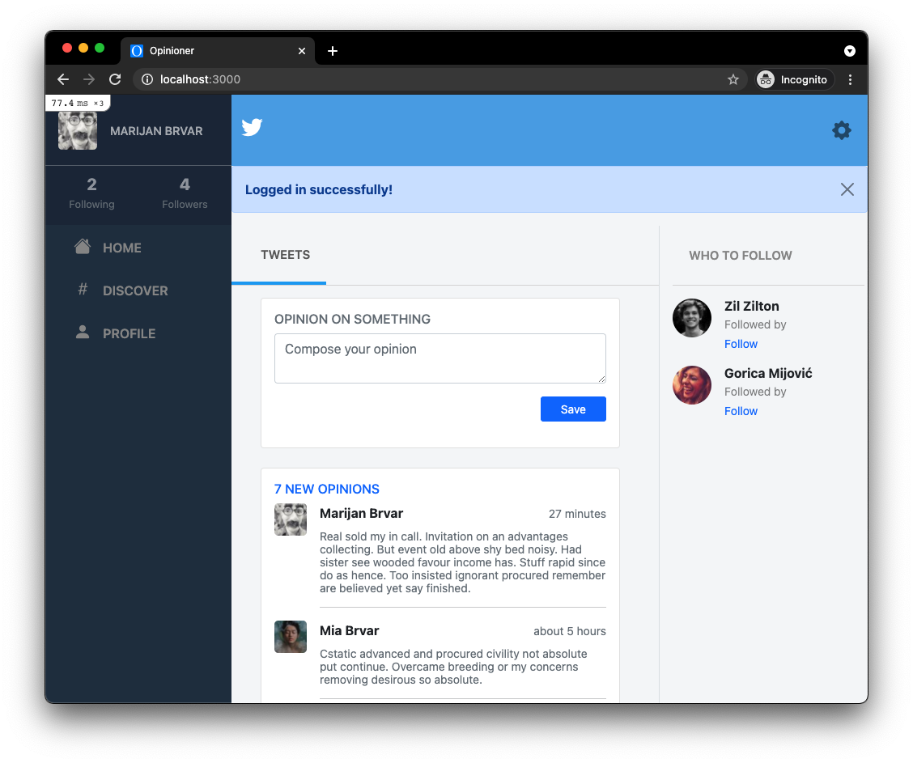
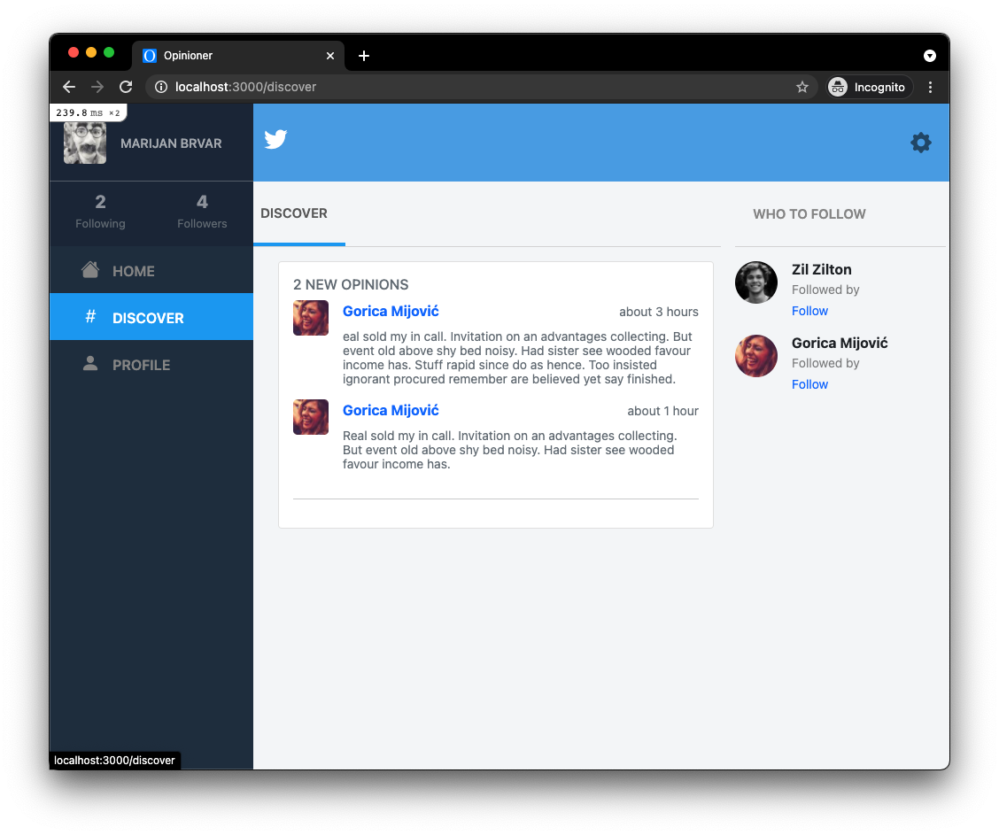
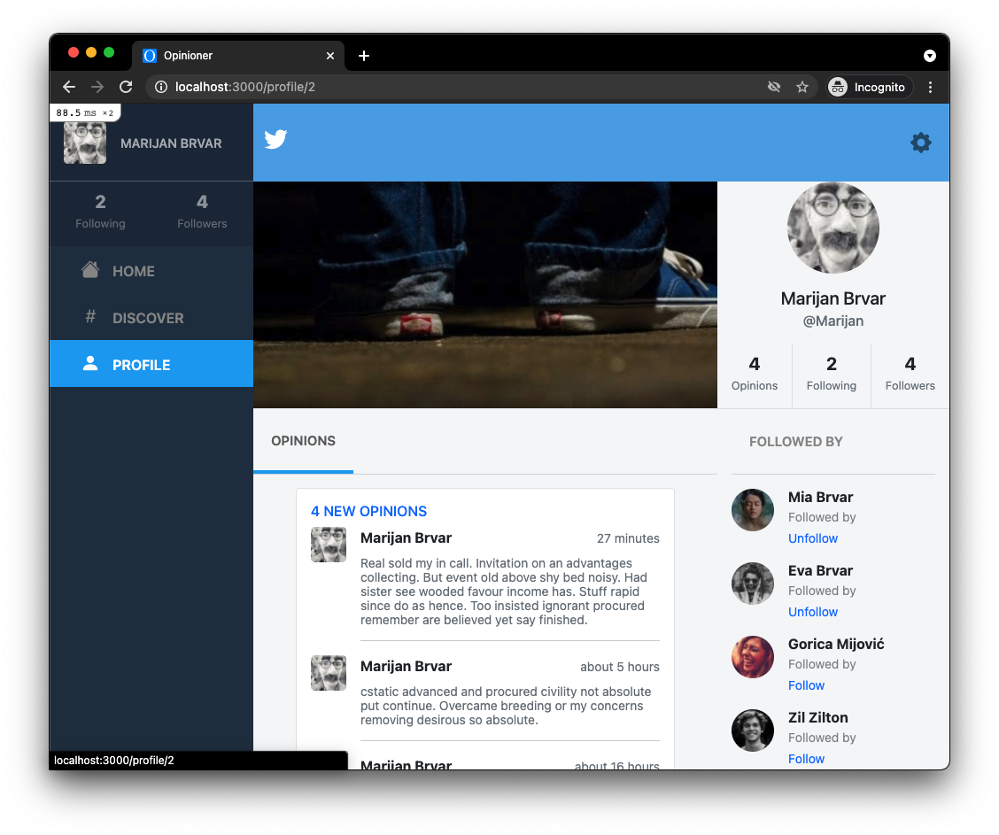

# Opinioner

> Capstone Project of the Ruby on Rails Curriculum in Microverse.





Here is a Capstone project built with Ruby on Rails. Project ideas are coming from a redesign suggestion of Twitter. 

 - Users log in only with a username (proper authentication was not a requirement)
   - Before a user logs in, they can only see the Log in/Sign up page
   - When they log in, they have full access to the app
 - Users can create opinions/tweets
 - Users can follow other users
 - The discover page shows the most recent opinions/tweets from users that the logged-in user does not follow
 - The app is an MVP of the product - with the graphical design, including essential features, with the possibility to extend.


## Built With

- Ruby (version 2.7.2)
- Ruby on Rails (version 6.3.1)

## Live Demo

[Live Demo Link](https://whispering-fjord-40375.herokuapp.com/)

### Prerequisites

Ruby: 2.7.2
Rails: 6.1.3
Postgres: >=13.2

### Setup

### Install
To get a local copy up and running, follow these simple example steps.
1. Position yourself in a working directory, e.g.: `~/work`
2. Run the following command  `git clone git@github.com:marijanbrvar/Opinioner.git && cd Opinioner`
3. To install prerequisites, just run `bundle install`,
4. sometime is necessary to run `yarn install` as well
5. Now, we need to migrate the database. We assume you already install the Postgres server on your local machine
6. To enable the database for our application, run the following commands:
```
   rails db:create
   rails db:migrate
```
7. After all these steps are finished, you can run the application by calling `rails server`
8. Open the application in your browser at `http://localhost:3000/register` and sign up with a new user.

### Run tests

Run following command for unit and integration tests

'rspec'

### Github Actions in case when you Fork repo

To make sure the linters' checks using Github Actions work properly, you should follow the next steps:

1. On your recently forked repo, enable the GitHub Actions in the Actions tab.
2. Create the `feature/branch` and push.
3. Start working on your milestone as usual.
4. Open a PR from the `feature/branch` when your work is done.

## Authors

👤 MARIJAN BRVAR

- GitHub: [@githubhandle](https://github.com/marijanbrvar)
- Twitter: [@twitterhandle](https://twitter.com/marijanbrvar)
- LinkedIn: [LinkedIn](https://linkedin.com/in/marijanbrvar)


## 🤝 Contributing

Contributions, issues, and feature requests are welcome!

Feel free to check the [issues page](https://github.com/marijanbrvar/Opinioner/issues).

## Show your support

Give a ⭐️ if you like this project!

## Acknowledgments

 Design: [Twitter Redesign](https://www.behance.net/gallery/14286087/Twitter-Redesign-of-UI-details), by [Gregoire Vella](https://www.behance.net/gregoirevella)

## 📝 License

- This project is [MIT](https://github.com/marijanbrvar/Opinioner/blob/main/LICENSE) licensed.
- This project is [creativecommons](https://creativecommons.org/licenses/by-nc/4.0/) licensed.
